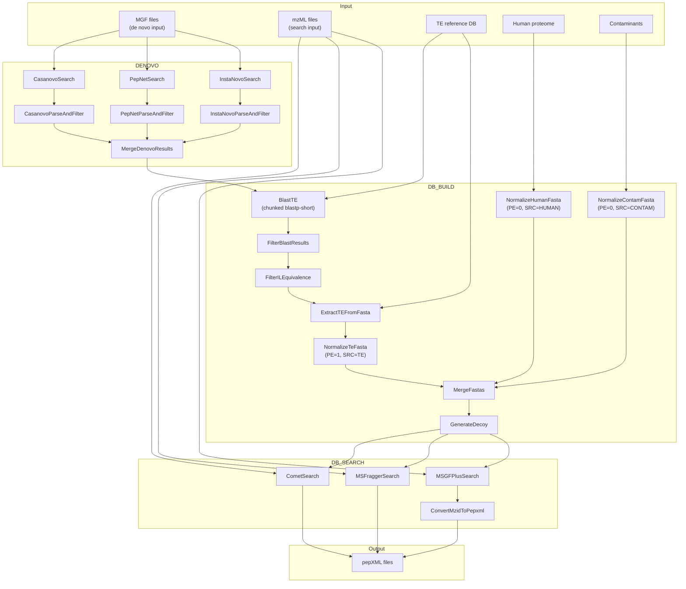

# nf-TIPs

Nextflow migration of [TIPs](https://github.com/WgShaoLab/TIPs) 

## Overview

nf-TIPs discovers TE-derived antigens in the immunopeptidome through four stages:

1. **De novo sequencing** — Casanovo, PepNet, InstaNovo on MGF files
2. **Database building** — BLAST TE selection, FASTA normalization, decoy generation
3. **Database search** — Comet, MSFragger, MSGF+ on mzML files
4. **Post-processing** — iProphet, FDR filtering, HLA prediction (not implemented)

### Pipeline DAG



**Data Flow:**
- `mgf/*.mgf` → **DENOVO** → merged FASTA (de novo peptide tags)
- merged FASTA → **DB_BUILD** → search databases per engine (with decoys)
- `mzML/*.mzML` + search DBs → **DB_SEARCH** → pepXML files

---

## Quick Start

### Prerequisites

- [Nextflow](https://www.nextflow.io/)
- Docker
- Conda

### Run the Pipeline

```bash
git clone https://github.com/your-org/nf-TIPs.git
cd nf-TIPs

# not tested yet!
nextflow run main.nf -c nextflow.config \
    --sample.path /path/to/your/sample \
    --sample.name YourSampleName
```

### Input Requirements

```
your_sample/
├── mgf/          # MGF files for de novo sequencing
│   └── *.mgf
└── mzML/         # mzML files for database search
    └── *.mzML
```

### Output Structure

```
your_sample/
├── Denovo/                      # De novo results
├── DB_search_iProphet/
│   ├── COMET/                   # Comet search DB + pepXML
│   ├── MSFRAGGER/               # MSFragger search DB + pepXML
│   └── MSGFPLUS/                # MSGF+ search DB + mzid/pepXML
└── ...
```

---

## Project Structure

```
nf-TIPs/
├── main.nf                     # Entry workflow
├── nextflow.config             # Params, containers, resources
├── subworkflows/
│   ├── denovo.nf               # De novo sequencing stage
│   ├── db_build.nf             # Database building stage
│   ├── db_search.nf            # Database search stage
│   └── postprocess.nf          # Post-processing stage (placeholder)
├── modules/
│   ├── denovo/
│   │   ├── casanovo.nf
│   │   ├── pepnet.nf
│   │   ├── instanovo.nf
│   │   └── merge_denovo.nf
│   ├── db_build/
│   │   ├── blast.nf
│   │   ├── filter_blast.nf
│   │   ├── extract_te.nf
│   │   ├── normalize_fasta.nf
│   │   ├── merge_fastas.nf
│   │   └── generate_decoy.nf
│   ├── db_search/
│   │   ├── comet.nf
│   │   ├── msfragger.nf
│   │   ├── msgfplus.nf
│   │   └── convert_mzid_to_pepxml.nf
│   └── postprocess/
│       ├── iprophet.nf
│       ├── fdr_filter.nf
│       ├── homology_filter.nf
│       └── hla_predict.nf
├── bin/                        # Python utility scripts
```

---

## Implementation Status

### Stage 1: De Novo Sequencing

| Module | File | Status | Notes |
|--------|------|--------|-------|
| Casanovo | [`modules/denovo/casanovo.nf`](modules/denovo/casanovo.nf) | ✅ Migrated | GPU support via container |
| PepNet | [`modules/denovo/pepnet.nf`](modules/denovo/pepnet.nf) | ✅ Migrated | Conda env |
| InstaNovo | [`modules/denovo/instanovo.nf`](modules/denovo/instanovo.nf) | ✅ Migrated | GPU support via container |
| Merge Results | [`modules/denovo/merge_denovo.nf`](modules/denovo/merge_denovo.nf) | ✅ Migrated | Python script |
| **Subworkflow** | [`subworkflows/denovo.nf`](subworkflows/denovo.nf) | ✅ Migrated | |

**Testing:**
- [ ] End-to-end test with real MGF files
- [ ] Validate GPU container execution
- [ ] Verify merged FASTA output format

---

### Stage 2: Database Building

| Module | File | Status | Notes |
|--------|------|--------|-------|
| BLAST TE | [`modules/db_build/blast.nf`](modules/db_build/blast.nf) | ✅ Migrated | blastp-short, chunked |
| Filter BLAST | [`modules/db_build/filter_blast.nf`](modules/db_build/filter_blast.nf) | ✅ Migrated | I/L equivalence check |
| Extract TE | [`modules/db_build/extract_te.nf`](modules/db_build/extract_te.nf) | ✅ Migrated | blastdbcmd or Python |
| Normalize FASTA | [`modules/db_build/normalize_fasta.nf`](modules/db_build/normalize_fasta.nf) | ✅ Migrated | PE tag, SRC tag |
| Merge FASTAs | [`modules/db_build/merge_fastas.nf`](modules/db_build/merge_fastas.nf) | ✅ Migrated | Human + TE + Contam |
| Generate Decoy | [`modules/db_build/generate_decoy.nf`](modules/db_build/generate_decoy.nf) | ✅ Migrated | Reverse sequences |
| **Subworkflow** | [`subworkflows/db_build.nf`](subworkflows/db_build.nf) | ✅ Migrated | |

**Testing:**

- [x] Tested with mini test data
- [x] Verified FASTA output structure
- [x] Confirmed decoy generation

---

### Stage 3: Database Search

| Module | File | Status | Notes |
|--------|------|--------|-------|
| Comet | [`modules/db_search/comet.nf`](modules/db_search/comet.nf) | ✅ Migrated | Container: `comet-ms` |
| MSFragger | [`modules/db_search/msfragger.nf`](modules/db_search/msfragger.nf) | ✅ Migrated | Container: `msfragger`, Java `-Xmx16G` |
| MSGF+ | [`modules/db_search/msgfplus.nf`](modules/db_search/msgfplus.nf) | ✅ Migrated | Container: `msgf_plus`, Java `-Xmx8G` |
| mzid → pepXML | [`modules/db_search/convert_mzid_to_pepxml.nf`](modules/db_search/convert_mzid_to_pepxml.nf) | ⚠️ Placeholder | Need TPP or ProteoWizard |
| **Subworkflow** | [`subworkflows/db_search.nf`](subworkflows/db_search.nf) | ✅ Migrated | |

**Testing:**

- [ ] Test Comet search with mzML input
- [ ] Test MSFragger search (verify jar path in container)
- [ ] Test MSGF+ search (verify jar path in container)
- [ ] Verify pepXML output locations

**Known Issues:**

- MSFragger/MSGF+ jar paths are hardcoded — need container verification
- Memory allocation (`-Xmx`) is hardcoded in script, should be config-driven

---

### Stage 4: Post-processing

| Module | File | Status | Notes |
|--------|------|--------|-------|
| iProphet | [`modules/postprocess/iprophet.nf`](modules/postprocess/iprophet.nf) | ❌ Not started | |
| FDR Filter | [`modules/postprocess/fdr_filter.nf`](modules/postprocess/fdr_filter.nf) | ❌ Not started | |
| Homology Filter | [`modules/postprocess/homology_filter.nf`](modules/postprocess/homology_filter.nf) | ❌ Not started | |
| HLA Predict | [`modules/postprocess/hla_predict.nf`](modules/postprocess/hla_predict.nf) | ❌ Not started | |
| **Subworkflow** | [`subworkflows/postprocess.nf`](subworkflows/postprocess.nf) | ❌ Not started | |

---

## TODO List

### High Priority

- [ ] **Test de novo stage** — no tests exist yet
- [ ] **Test db_search stage** — Comet, MSFragger, MSGF+ with real mzML
- [ ] **Implement mzid → pepXML conversion**
  - Option A: TPP `idconvert`
  - Option B: ProteoWizard `idconvert`
  - Current: placeholder in [`convert_mzid_to_pepxml.nf`](modules/db_search/convert_mzid_to_pepxml.nf)

### Container Verification

- [ ] Verify MSFragger jar location inside `quay.io/biocontainers/msfragger:4.2--py311hdfd78af_0`
  - Currently hardcoded: `/opt/MSFragger/MSFragger.jar`
- [ ] Verify MSGF+ jar location inside `quay.io/biocontainers/msgf_plus:2024.03.26--hdfd78af_0`
  - Currently hardcoded: `/opt/MSGFPlus/MSGFPlus.jar`
- [ ] Find container with `idconvert` for mzid → pepXML

### Resource Configuration

- [ ] Move Java `-Xmx` from hardcoded script to `nextflow.config`
  - MSFragger: currently `-Xmx16G` in [`msfragger.nf`](modules/db_search/msfragger.nf)
  - MSGF+: currently `-Xmx8G` in [`msgfplus.nf`](modules/db_search/msgfplus.nf)
- [ ] Add CPU/memory directives per process in config

### Future Work

- [ ] Implement post-processing stage (iProphet, FDR, homology, HLA)
- [ ] Add test workflow for each stage
- [ ] Create example params file
- [ ] Documentation for running full pipeline

---

## Quick Reference

### Containers Used

| Process | Container |
|---------|-----------|
| CasanovoSearch | `quay.io/protio/casanovo:4.2.0` |
| InstaNovoSearch | `quay.io/biocontainers/instanovo:1.2.2--pyhdfd78af_1` |
| CometSearch | `quay.io/biocontainers/comet-ms:2024011--hb319eff_0` |
| MSFraggerSearch | `quay.io/biocontainers/msfragger:4.2--py311hdfd78af_0` |
| MSGFPlusSearch | `quay.io/biocontainers/msgf_plus:2024.03.26--hdfd78af_0` |
| BLAST processes | `quay.io/biocontainers/blast:2.17.0--h66d330f_0` |

### Key Files

- Entry point: [`main.nf`](main.nf)
- Config: [`nextflow.config`](nextflow.config)
- Test config: [`test/nextflow.test.config`](test/nextflow.test.config)

---

## For Developers

### Code Organization

| Layer | Purpose | Example |
|-------|---------|---------|
| `main.nf` | Entry point, wires subworkflows | `DENOVO(mgf) → DB_BUILD(fasta) → DB_SEARCH(mzml, dbs)` |
| `subworkflows/*.nf` | Stage-level logic | `DB_SEARCH` combines Comet + MSFragger + MSGF+ |
| `modules/*/*.nf` | Single-tool processes | `CometSearch`, `MSFraggerSearch` |
| `bin/*.py` | Reusable Python scripts | `fasta_utils.py`, `sequence_filters.py` |

### Adding a New Process

1. Create module file in appropriate `modules/` subdirectory
2. Follow existing patterns (see [`modules/db_search/comet.nf`](modules/db_search/comet.nf))
3. Add container/conda in [`nextflow.config`](nextflow.config)
4. Include in relevant subworkflow

```groovy
// Example: modules/db_search/comet.nf
process CometSearch {
    publishDir "${params.sample.path}/DB_search_iProphet/COMET", mode: 'copy'

    input:
    tuple path(mzml), path(search_db), val(params_file)

    output:
    path "*.pep.xml"

    script:
    // from pipelines_dbsearch.py lines 208-219
    """
    comet -P${params_file} -D${search_db} "${mzml}"
    """
}
```